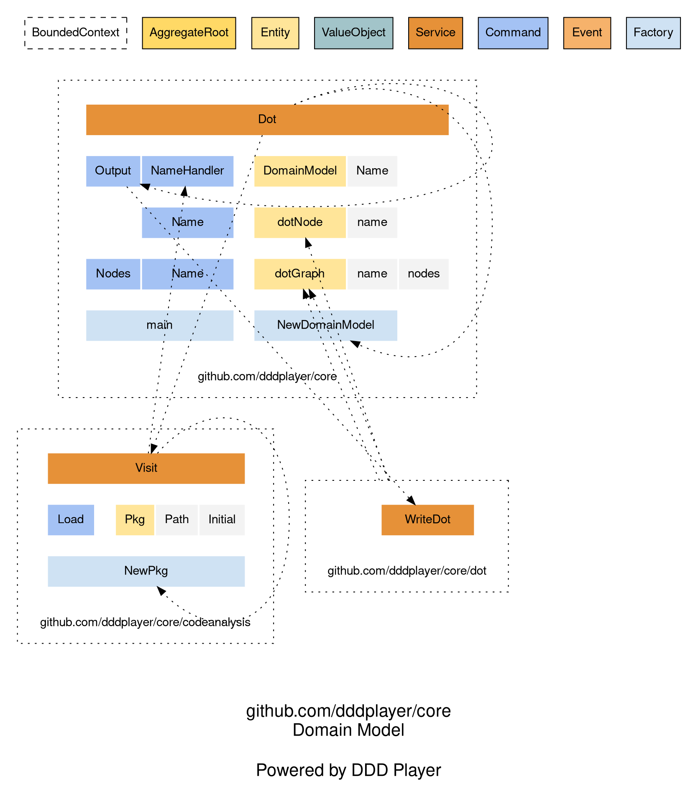

# ddd-player@core

```dot
digraph {
fontname="Helvetica, Arial, sans-serif"
node [fontname="Helvetica, Arial, sans-serif"]
edge [fontname="Helvetica, Arial, sans-serif"]
graph [style=invis]

    subgraph cluster_ddd_concept{
        node [shape=rect]
        edge [style=invis]

        {rank=same node0 node1 node2 node3 node4 node5 node6 node7}

        node7 [label="Factory" style=filled fillcolor="#cfe2f3ff"]
        node6 [label="Event" style=filled fillcolor="#f6b26bff"]
        node5 [label="Command" style=filled fillcolor="#a4c2f4ff"]
        node4 [label="Service" style=filled fillcolor="#e69138ff"]
        node3 [label="ValueObject" style=filled fillcolor="#a2c4c9ff"]
        node2 [label="Entity" style=filled fillcolor="#ffe599ff"]
        node1 [label="AggregateRoot" style=filled fillcolor="#ffd966ff"]
        node0 [label="BoundedContext" style=dashed fillcolor="#ffffff00"]

        node0 -> node1 -> node2 -> node3 -> node4 -> node5 -> node6 -> node7

    }

    subgraph cluster_entity {
        node [style=dotted shape=rect]


			ddd_player [label=<
        <table border="0" cellpadding="10">

				<tr>

			<td port="first_blank_row" bgcolor="white" rowspan="1" colspan="1"></td>
	</tr>
				<tr>

			<td port="" bgcolor="white" rowspan="1" colspan="1"></td>
			<td port="service_Dot" bgcolor="#e69138ff" rowspan="1" colspan="6">Dot</td>
	</tr>
				<tr>

			<td port="" bgcolor="white" rowspan="1" colspan="1"></td>
	</tr>
				<tr>

			<td port="" bgcolor="white" rowspan="1" colspan="1"></td>
			<td port="entity_DomainModel_Output" bgcolor="#a4c2f4ff" rowspan="1" colspan="1">Output</td>
			<td port="entity_DomainModel_NameHandler" bgcolor="#a4c2f4ff" rowspan="1" colspan="1">NameHandler</td>
			<td port="" bgcolor="white" rowspan="1" colspan="1"></td>
			<td port="entity_DomainModel" bgcolor="#ffe599ff" rowspan="1" colspan="1">DomainModel</td>
			<td port="entity_DomainModel_Name" bgcolor="#f3f3f3ff" rowspan="1" colspan="1">Name</td>
			<td port="" bgcolor="white" rowspan="1" colspan="1"></td>
			<td port="" bgcolor="white" rowspan="1" colspan="1"></td>
	</tr>
				<tr>

			<td port="" bgcolor="white" rowspan="1" colspan="1"></td>
	</tr>
				<tr>

			<td port="" bgcolor="white" rowspan="1" colspan="1"></td>
			<td port="" bgcolor="white" rowspan="1" colspan="1"></td>
			<td port="entity_dotNode_Name" bgcolor="#a4c2f4ff" rowspan="1" colspan="1">Name</td>
			<td port="" bgcolor="white" rowspan="1" colspan="1"></td>
			<td port="entity_dotNode" bgcolor="#ffe599ff" rowspan="1" colspan="1">dotNode</td>
			<td port="entity_dotNode_name" bgcolor="#f3f3f3ff" rowspan="1" colspan="1">name</td>
			<td port="" bgcolor="white" rowspan="1" colspan="1"></td>
			<td port="" bgcolor="white" rowspan="1" colspan="1"></td>
	</tr>
				<tr>

			<td port="" bgcolor="white" rowspan="1" colspan="1"></td>
	</tr>
				<tr>

			<td port="" bgcolor="white" rowspan="1" colspan="1"></td>
			<td port="entity_dotGraph_Nodes" bgcolor="#a4c2f4ff" rowspan="1" colspan="1">Nodes</td>
			<td port="entity_dotGraph_Name" bgcolor="#a4c2f4ff" rowspan="1" colspan="1">Name</td>
			<td port="" bgcolor="white" rowspan="1" colspan="1"></td>
			<td port="entity_dotGraph" bgcolor="#ffe599ff" rowspan="1" colspan="1">dotGraph</td>
			<td port="entity_dotGraph_name" bgcolor="#f3f3f3ff" rowspan="1" colspan="1">name</td>
			<td port="entity_dotGraph_nodes" bgcolor="#f3f3f3ff" rowspan="1" colspan="1">nodes</td>
			<td port="" bgcolor="white" rowspan="1" colspan="1"></td>
	</tr>
				<tr>

			<td port="" bgcolor="white" rowspan="1" colspan="1"></td>
	</tr>
				<tr>

			<td port="" bgcolor="white" rowspan="1" colspan="1"></td>
			<td port="ddd_player_main" bgcolor="#cfe2f3ff" rowspan="1" colspan="2">main</td>
			<td port="" bgcolor="white" rowspan="1" colspan="1"></td>
			<td port="factory_NewDomainModel" bgcolor="#cfe2f3ff" rowspan="1" colspan="2">NewDomainModel</td>
	</tr>
				<tr>

			<td port="" bgcolor="white" rowspan="1" colspan="1"></td>
	</tr>
				<tr>

			<td port="" bgcolor="white" rowspan="1" colspan="8">github.com/dddplayer/core</td>
	</tr>
        </table>
        > ]
			codeanalysis [label=<
        <table border="0" cellpadding="10">

				<tr>

			<td port="first_blank_row" bgcolor="white" rowspan="1" colspan="1"></td>
	</tr>
				<tr>

			<td port="" bgcolor="white" rowspan="1" colspan="1"></td>
			<td port="service_Visit" bgcolor="#e69138ff" rowspan="1" colspan="5">Visit</td>
	</tr>
				<tr>

			<td port="" bgcolor="white" rowspan="1" colspan="1"></td>
	</tr>
				<tr>

			<td port="" bgcolor="white" rowspan="1" colspan="1"></td>
			<td port="entity_Pkg_Load" bgcolor="#a4c2f4ff" rowspan="1" colspan="1">Load</td>
			<td port="" bgcolor="white" rowspan="1" colspan="1"></td>
			<td port="entity_Pkg" bgcolor="#ffe599ff" rowspan="1" colspan="1">Pkg</td>
			<td port="entity_Pkg_Path" bgcolor="#f3f3f3ff" rowspan="1" colspan="1">Path</td>
			<td port="entity_Pkg_Initial" bgcolor="#f3f3f3ff" rowspan="1" colspan="1">Initial</td>
			<td port="" bgcolor="white" rowspan="1" colspan="1"></td>
	</tr>
				<tr>

			<td port="" bgcolor="white" rowspan="1" colspan="1"></td>
	</tr>
				<tr>

			<td port="" bgcolor="white" rowspan="1" colspan="1"></td>
			<td port="factory_NewPkg" bgcolor="#cfe2f3ff" rowspan="1" colspan="5">NewPkg</td>
	</tr>
				<tr>

			<td port="" bgcolor="white" rowspan="1" colspan="1"></td>
	</tr>
				<tr>

			<td port="" bgcolor="white" rowspan="1" colspan="7">github.com/dddplayer/core/codeanalysis</td>
	</tr>
        </table>
        > ]
			dot [label=<
        <table border="0" cellpadding="10">

				<tr>

			<td port="first_blank_row" bgcolor="white" rowspan="1" colspan="1"></td>
	</tr>
				<tr>

			<td port="" bgcolor="white" rowspan="1" colspan="1"></td>
			<td port="service_WriteDot" bgcolor="#e69138ff" rowspan="1" colspan="4">WriteDot</td>
	</tr>
				<tr>

			<td port="" bgcolor="white" rowspan="1" colspan="1"></td>
	</tr>
				<tr>

			<td port="" bgcolor="white" rowspan="1" colspan="6">github.com/dddplayer/core/dot</td>
	</tr>
        </table>
        > ]

    }

	node0 -> ddd_player:first_blank_row [style=invis]


		ddd_player:entity_DomainModel_Output -> dot:service_WriteDot  [style=dotted]
		ddd_player:service_Dot -> ddd_player:factory_NewDomainModel  [style=dotted]
		ddd_player:service_Dot -> codeanalysis:service_Visit  [style=dotted]
		ddd_player:service_Dot -> ddd_player:entity_DomainModel_Output  [style=dotted]
		codeanalysis:service_Visit -> codeanalysis:factory_NewPkg  [style=dotted]
		codeanalysis:service_Visit -> ddd_player:entity_DomainModel_NameHandler  [style=dotted]
		dot:entity_DotGraph -> ddd_player:entity_dotGraph  [style=dotted]
		dot:entity_DotNode -> ddd_player:entity_dotGraph  [style=dotted]
		dot:entity_DotNode -> ddd_player:entity_dotNode  [style=dotted]

	label = "\n\ngithub.com/dddplayer/core\nDomain Model\n\nPowered by DDD Player";
    fontsize=20;
}

```
